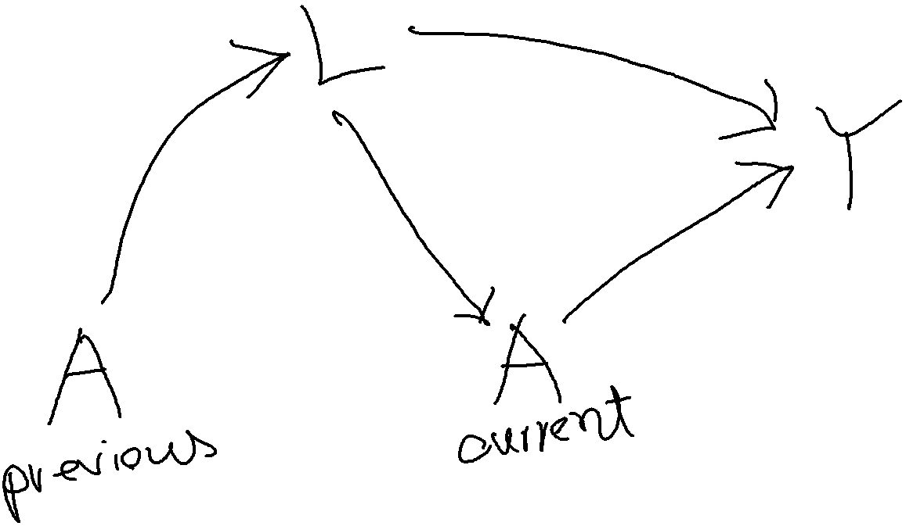

```{r setup, include=FALSE}
knitr::opts_chunk$set(echo = TRUE)
require(survival)
require(dplyr)
require(ggplot2)
```

# Simulation setting

## Notation

- A Treatment
  - Alag Lag values of A
- L time-dependent confounder that impacts future treatment
  - Llag Lag values of L
- Y Outcome
  - Ylag Lag values of Y
- tpoint Time index
  - tpoint0 Lag values of tpoint
- id Subject ID

## Parameter List

- theta2 is the target parameter 
  - treatment effect in beta coef
  
```{r}
alpha0 <- 0.5 # Exposure / A model (intercept)
alpha1 <- 0.5 # Exposure / A model (slope for L)
beta0 <- 0  # Time-dependent variable / L model (intercept)
beta1 <- -5 # Time-dependent variable / L model (slope for Alag)
theta0 <- -3 # Outcome / Y model (intercept)
theta1 <- -2 # Outcome / Y model (slope for L)
theta2 <- -0.8 # Outcome / Y model (slope for A)
```
  
## Simulation Details  

100 simulation iterations were performed: 

- with 2,500 subjects in each simulation, 
- with up to 10 followup. 
  - Followup could be less than 10, dependent on theta0.

```{r}
followup <- 10 # followup
n <- 2500 # subjects per simulation
NSim <- 100 # number of simulations
saved.data <- vector(mode = "list", length = NSim)
set.seed(112) # Seed for randomization
```

# Simulation 

## Data generation mechanism



## Core function

Codes ported to R from Young, J. G., & Tchetgen Tchetgen, E. J. (2014)

```{r, eval=FALSE}
for (k in 1:NSim){ # simulation index k
  aggregate.data <- NULL
  for (j in 1:n){ # j = subject index
    id <- j
    # Data generation in follow-up time 1
    tpoint <- 1
    Alag <- 0
    pL <- 0.5
    uL <- runif(1)
    L <- ifelse(uL <= pL, 1, 0)
    
    logitA <- alpha0
    pA <- 1/(1+exp(-logitA))
    uA <- runif(1)
    A <- ifelse(uA <= pA, 1, 0)
    
    logitY <- theta0 + (theta1 * L) + (theta2 * A)
    pY <-  1/(1+exp(-logitY))
    uY <- runif(1)
    Y <- ifelse(uY <= pY, 1, 0)
    Ylag <- Y
    
    long.form.data <- data.frame(id, tpoint, Alag, L, A, Y)
    
    if (Ylag == 0){ 
        # Stop if event (death) already occurred
      for (i in 2:followup){ # i followup index
        Alag <- A
        tpoint <- i
        
        logitL <- beta0 + beta1 * Alag
        pL <- 1/(1+exp(-logitL))
        uL <- runif(1)
        L <- ifelse(uL <= pL, 1, 0)
        
        logitA <- alpha0 + alpha1 * L
        pA <- 1/(1+exp(-logitA))
        uA <- runif(1)
        A <- ifelse(uA <= pA, 1, 0)
        
        logitY <- theta0 + (theta1 * L) + (theta2 * A)
        pY <-  1/(1+exp(-logitY))
        uY <- runif(1)
        Y <- ifelse(uY <= pY, 1, 0)
        long.form.data <- rbind(long.form.data, c(id, tpoint, Alag, L, A, Y, Ylag))
        if (Y == 1) {break}
      }
    } 
    aggregate.data <- rbind(aggregate.data,long.form.data)
    # aggregated data for 1 patient (id = j for all followups)
  }
  
  library(dplyr)
  aggregate.data <- 
    aggregate.data %>%
    group_by(id) %>%
    mutate(Llag = dplyr::lag(L, n = 1, default = 0))
  aggregate.data <- 
    aggregate.data %>%
    group_by(id) %>%
    mutate(tpoint0 = dplyr::lag(tpoint, n = 1, default = 0))
  
  #write.csv(aggregate.data, file = paste0("data/file", k, ".csv"))
  saved.data[[k]] <- aggregate.data
  # aggregated data for all patients (in simulation iteration = k)
  #print(k)
}

saveRDS(saved.data, file = "data/savedData.rds")
```

## Extraction function

Function to extract results

```{r}
ext.cox <- function(fit){
  x <- summary(fit)
  b.se <- ifelse(x$used.robust == TRUE, x$coef["A","robust se"], x$coef["A","se(coef)"])
  if (is.null(fit$weights)) {
    res <- as.numeric(c(x$n, x$nevent, x$coef["A","coef"], b.se, 
                        confint(fit)["A",],x$coef["A", "Pr(>|z|)"], x$used.robust,
                        rep(NA,3) ))
  } else {
    res <- as.numeric(c(x$n, x$nevent, x$coef["A","coef"], b.se, 
                        confint(fit)["A",],x$coef["A", "Pr(>|z|)"], x$used.robust,
                        mean(fit$weights), range(fit$weights) ))
  }
  names(res) <- c("n", "events", "coef", "se", "lowerci", "upperci", "pval", "robust", "meanW", "minW", "maxW")
  return(res)
}
```

## Read saved data and obtain results

Fitting modes and obtaining results

```{r, cache=TRUE}
saved.data <- readRDS(file = "data/savedData.rds")
mat.cox.adj.all <- mat.cox.all <- mat.msm.w.all <- mat.msm.all <- NULL
for (k in 1:NSim){
  #aggregate.data <- read.csv(file = paste0("data/file", k, ".csv"))
  aggregate.data <- saved.data[[k]]
  # Step 1: Weight denominator model
  ww <- glm(A ~ tpoint + L + Alag + Llag, family = binomial(logit), data = aggregate.data)
  # Step 2: Weight numerator model
  ww0 <- glm(A ~ tpoint + Alag, family = binomial(logit), data = aggregate.data)
  # Step 3: Obtain fir from the weight models
  aggregate.data$wwp <- with(aggregate.data, ifelse(A == 0, 1 - fitted(ww), fitted(ww)))
  aggregate.data$wwp0 <- with(aggregate.data, ifelse(A == 0, 1 - fitted(ww0),fitted(ww0)))
  # Step 4: time-dependent weights
  aggregate.data$w <- unlist(tapply(1/aggregate.data$wwp, aggregate.data$id, cumprod))
  aggregate.data$sw <- unlist(tapply(aggregate.data$wwp0/aggregate.data$wwp, aggregate.data$id, cumprod))
  summary(aggregate.data$sw)
  require(survival)
  # Step 5: Weighted outcome model
  fit.msm.w <- coxph(Surv(tpoint0, tpoint, Y) ~ A + cluster(id), data = aggregate.data, weight = w, robust =TRUE)
  mat.msm.w <- ext.cox(fit.msm.w)
  fit.msm <- coxph(Surv(tpoint0, tpoint, Y) ~ A + cluster(id), data = aggregate.data, weight = sw, robust =TRUE)
  mat.msm <- ext.cox(fit.msm)
  # Comparison with unweighted models
  fit.cox <- coxph(Surv(tpoint0, tpoint, Y) ~ A + cluster(id), data = aggregate.data, robust =TRUE)
  mat.cox <- ext.cox(fit.cox)
  fit.cox.adj <- coxph(Surv(tpoint0, tpoint, Y) ~ A + L + cluster(id), data = aggregate.data, robust =TRUE)
  mat.cox.adj <- ext.cox(fit.cox.adj)
  # Results
  mat.cox.all <- as.data.frame(rbind(mat.cox.all, mat.cox))
  mat.cox.adj.all <- as.data.frame(rbind(mat.cox.adj.all, mat.cox.adj))
  mat.msm.w.all <- as.data.frame(rbind(mat.msm.w.all, mat.msm.w))
  mat.msm.all <- as.data.frame(rbind(mat.msm.all, mat.msm))
  # print(k)
}
```

## Save results

Saving results locally

```{r}
saveRDS(mat.cox.all, file = "data/cox.rds")
saveRDS(mat.cox.adj.all, file = "data/coxL.rds")
saveRDS(mat.msm.w.all, file = "data/msmw.rds")
saveRDS(mat.msm.all, file = "data/msm.rds")
```


# Results
## Detailed Results

True value for theta2
```{r}
theta2
```


Coefs from unadjusted Cox regression, blue line is the reference theta2=-0.8. Red line is the mean of coefs.
```{r}
require(ggplot2)
p <- ggplot(mat.cox.all, aes(x=coef)) + 
  geom_density()
p+ geom_vline(aes(xintercept=mean(coef)),
            color="red", linetype="dashed", size=1)+
  geom_vline(xintercept=-0.8, color ="blue")
```

Coefs from adjusted Cox regression (adjusted by L)
```{r}
p <- ggplot(mat.cox.adj.all, aes(x=coef)) + 
  geom_density()
p+ geom_vline(aes(xintercept=mean(coef)),
            color="red", linetype="dashed", size=1) +
  geom_vline(xintercept=-0.8, color ="blue")
```

Coefs from MSM (unstabilized weights used)
```{r}
p <- ggplot(mat.msm.w.all, aes(x=coef)) + 
  geom_density()
p+ geom_vline(aes(xintercept=mean(coef)),
            color="red", linetype="dashed", size=1) + 
  geom_vline(xintercept=-0.8, color ="blue")
```

Coefs from MSM (stabilized weights used)
```{r}
p <- ggplot(mat.msm.all, aes(x=coef)) + 
  geom_density()
p+ geom_vline(aes(xintercept=mean(coef)),
            color="red", linetype="dashed", size=1) +
  geom_vline(xintercept=-0.8, color ="blue")
```

## Print Summary Results

Percent bias from unadjusted Cox regression
```{r}
cat(round((mean(mat.cox.all$coef)-theta2)*100/theta2,2), "%")
```

Percent bias from adjusted Cox regression (adjusted by L)
```{r}
cat(round((mean(mat.cox.adj.all$coef)-theta2)*100/theta2,2), "%")
```

Percent bias from MSM (unstabilized weights used)
```{r}
cat(round((mean(mat.msm.w.all$coef)-theta2)*100/theta2,2), "%")
```

Investigating unstabilized weights (large weights)
```{r}
round(range(mat.msm.w.all$maxW),2)
```

Percent bias from MSM (stabilized weights used)
```{r}
cat(round((mean(mat.msm.all$coef)-theta2)*100/theta2,2), "%")
```

Investigating stabilized weights (reasonable weights)
```{r}
round(range(mat.msm.all$maxW),2)
```

# Reference

- Codes ported to R from Young, J. G., & Tchetgen Tchetgen, E. J. (2014). Simulation from a known Cox MSM using standard parametric models for the g‐formula. Statistics in medicine, 33(6), 1001-1014. https://onlinelibrary.wiley.com/doi/full/10.1002/sim.5994
- Codes ported by Ehsan Karim http://ehsank.com/
- Also see https://github.com/ehsanx/genMSM